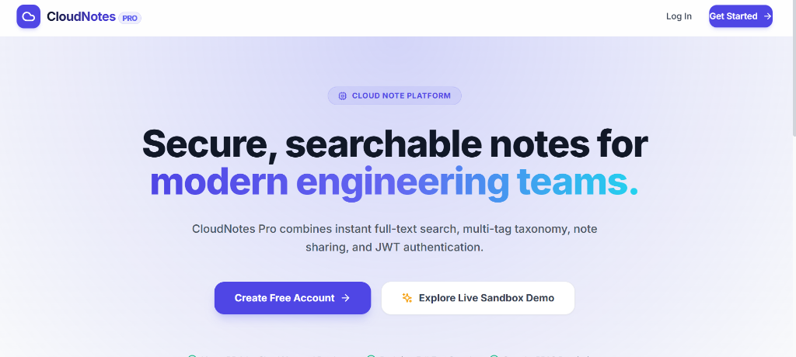
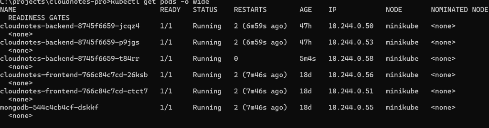
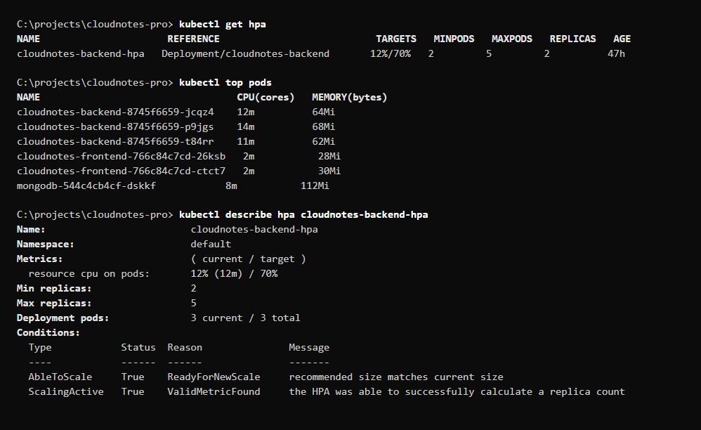

# CloudNotes Pro: Full-Stack Cloud Notes & DevOps Infrastructure

[](https://nodejs.org/)
[](https://www.typescriptlang.org/)
[](https://reactjs.org/)
[](https://vitejs.dev/)
[](https://www.mongodb.com/)
[](https://www.docker.com/)
[](https://kubernetes.io/)
[](https://www.terraform.io/)
[](https://aws.amazon.com/)
[](https://github.com/features/actions)

---

## Overview

**CloudNotes Pro** is a full-stack, cloud-native note-taking web application engineered to demonstrate end-to-end software development and modern DevOps/Cloud engineering practices.

The project bridges application design with production-ready cloud deployment, encompassing:
1. **Application Engineering**: Full-stack TypeScript architecture using React 18, Vite, Node.js/Express, and MongoDB.
2. **Containerization**: Multi-stage Docker builds and multi-container orchestration via Docker Compose.
3. **Infrastructure as Code (IaC)**: Automated provisioning of AWS cloud infrastructure using Terraform.
4. **Kubernetes Orchestration**: Deployment on a Minikube cluster featuring automated scaling (HPA), persistent storage (PVC), self-healing health probes, and ingress routing.
5. **Continuous Integration & Delivery (CI/CD)**: GitHub Actions workflow automating build verification, container registry publishing (GHCR), and automated deployment.

### Development-to-Deployment Journey

```
┌─────────────────┐     ┌──────────────────┐     ┌──────────────────┐
│   Application   │ ──► │  Containerization │ ──► │ AWS Infrastructure│
│ React + Node.js │     │ Docker + Compose │     │    (Terraform)   │
└─────────────────┘     └──────────────────┘     └──────────────────┘
                                                           │
┌─────────────────┐     ┌──────────────────┐               │
│ Verification &  │ ◄── │    Kubernetes    │ ◄─────────────┘
│ Auto-scaling    │     │ Minikube + HPA   │
└─────────────────┘     └──────────────────┘
```

---

## Architecture

### Kubernetes Architecture

The application is deployed on Kubernetes using modular manifests. Ingress exposes the frontend and API routes, backed by ClusterIP services, ConfigMaps, Secrets, and persistent storage.

```mermaid
graph TD
    User([Client / Browser]) -->|HTTP / HTTPs| Ingress[Kubernetes Ingress<br/>cloudnotes-ingress]
    
    subgraph Kubernetes Cluster / Minikube
        Ingress -->|Path /| SvcFrontend[Frontend Service<br/>ClusterIP:80]
        Ingress -->|Path /api| SvcBackend[Backend Service<br/>ClusterIP:5000]
        
        SvcFrontend --> PodFrontend[Frontend Pod<br/>cloudnotes-frontend]
        
        subgraph Backend Deployment
            SvcBackend --> PodBackend1[Backend Pod 1<br/>cloudnotes-backend]
            SvcBackend --> PodBackend2[Backend Pod 2<br/>cloudnotes-backend]
        end
        
        PodBackend1 -->|Read / Write| SvcMongo[MongoDB Service<br/>ClusterIP:27017]
        PodBackend2 -->|Read / Write| SvcMongo
        
        SvcMongo --> PodMongo[MongoDB Pod<br/>cloudnotes-mongodb]
        PodMongo --> PVC[PersistentVolumeClaim<br/>mongodb-pvc]
        
        CM[ConfigMap<br/>backend-config] -.->|Environment| PodBackend1
        Secret[Secret<br/>backend-secret] -.->|JWT Secret| PodBackend1
        
        HPA[Horizontal Pod Autoscaler<br/>Target: 70% CPU | Replicas: 2-5] -.->|Scales| Backend Deployment
    end
```

### AWS Infrastructure Architecture (Terraform)

Cloud infrastructure is defined via Terraform to provision server capacity on Amazon Web Services (AWS) using existing networking constructs.

```mermaid
graph TD
    TF[Terraform CLI] -->|Applies Manifests| AWS[AWS Cloud Provider]
    
    subgraph AWS VPC: vpc-04fdee8e108d118e9
        subgraph Public Subnet: subnet-05f46b8cc5f5b9c8c
            SG[Security Group: sg-09db7c19f8410116d<br/>Ports: 22, 80, 443, 5000, 3000]
            
            EC2[EC2 Instance: cloudnotes-server<br/>Type: t3.small | Tag: cloudnotes-pro]
            
            SG --> EC2
        end
    end
```

> **Note**: Infrastructure state is managed separately via Terraform, while local container orchestration testing and validation were performed on Minikube.

---

## Features

- **Full-Stack Note Management**: Complete CRUD capabilities for notes with titles, content, categories, and tags.
- **User Authentication**: Secure JWT-based registration and login with bcrypt password hashing.
- **Responsive Modern UI**: Built with React 18, Vite, Tailwind CSS, and Lucide icons.
- **Health Monitoring Endpoint**: Dedicated `/health` endpoint for readiness/liveness checks.
- **Telemetry & Metrics**: Exposes Prometheus metrics via `prom-client` at `/metrics`.
- **Stateless Backend Scaling**: Backend service configured for horizontal autoscaling without session state lock-in.
- **Persistent Database Storage**: MongoDB data retention secured via Kubernetes `PersistentVolumeClaim`.

---

## Tech Stack

| Domain | Technology / Tool | Usage in Project |
| :--- | :--- | :--- |
| **Frontend** | React 18, TypeScript, Vite, Tailwind CSS | Single Page Application UI layer |
| **Backend** | Node.js, Express, TypeScript | RESTful API server, middleware, authentication |
| **Database** | MongoDB, Mongoose | NoSQL document storage with volume persistence |
| **Containerization** | Docker, Docker Compose | Multi-stage container builds & local orchestration |
| **Orchestration** | Kubernetes (Minikube) | Deployments, Services, ConfigMaps, Secrets, PVC, Ingress, HPA |
| **Infrastructure as Code**| Terraform (AWS Provider `~> 6.0`) | Automated AWS EC2 host provisioning |
| **Cloud Provider** | AWS (EC2, VPC, Subnet, Security Group) | Virtual server host deployment |
| **CI/CD & Storage** | GitHub Actions, GitHub Container Registry | Automated testing, build, image push, and SSH deployment |

---

## Project Structure

```
cloudnotes-pro/
├── .github/
│   └── workflows/
│       └── ci.yml             # GitHub Actions CI/CD pipeline
├── backend/                   # Node.js Express TypeScript API
│   ├── src/                   # Server routes, models, middleware, controllers
│   ├── Dockerfile             # Multi-stage production container build
│   └── package.json           # Node.js dependencies & scripts
├── frontend/                  # React 18 Vite SPA UI
│   ├── src/                   # Components, pages, state hooks, styling
│   ├── Dockerfile             # Multi-stage Vite + Nginx production container
│   └── package.json           # Frontend dependencies
├── k8s/                       # Kubernetes manifests
│   ├── backend-configmap.yaml # Environment configurations
│   ├── backend-deployment.yaml# Backend Deployment with probes & resource limits
│   ├── backend-hpa.yaml       # Horizontal Pod Autoscaler configuration
│   ├── backend-secret.yaml    # Opaque Secret for JWT credentials
│   ├── backend-service.yaml   # ClusterIP Service for backend (port 5000)
│   ├── frontend-deployment.yaml# Frontend Deployment definition
│   ├── frontend-service.yaml  # ClusterIP Service for frontend (port 80)
│   ├── ingress.yaml           # Nginx Ingress routing rules
│   ├── mongodb-deployment.yaml# MongoDB database Deployment
│   ├── mongodb-pvc.yaml       # Persistent Volume Claim for database storage
│   └── mongodb-service.yaml   # ClusterIP Service for MongoDB (port 27017)
├── terraf/                    # Infrastructure as Code (Terraform)
│   ├── main.tf                # AWS provider, data sources & EC2 instance
│   ├── variables.tf           # Terraform variables (AWS region)
│   └── outputs.tf             # Outputs definition
├── docs/                      # Documentation & Screenshots
│   ├── screenshots/           # Application & cluster visual evidence
│   ├── api-docs.md            # API endpoint specifications
│   └── devops-guide.md        # DevOps implementation notes
├── docker-compose.yml         # Local multi-container development configuration
├── .gitignore                 # Version control exclusion rules
└── README.md                  # Project documentation
```

---

## Application Development

The CloudNotes application consists of three decoupled components:
- **Frontend SPA**: React 18 compiled via Vite, using `react-router-dom` for navigation, Axios for HTTP communications, and React Query for state cache management.
- **Backend API**: Modular TypeScript Express architecture implementing strict request validation, global error handling wrappers, JWT token issue/verification, and Mongoose schemas.
- **MongoDB Persistence**: MongoDB instance configured to maintain index constraints and reliable data storage.

---

## Dockerization

Multi-stage `Dockerfile` manifests optimize build layers and runtime image sizes:

### Backend Dockerfile Strategy
- **Stage 1 (Build)**: Installs development dependencies and executes TypeScript compilation (`tsc`) producing static JS in `/dist`.
- **Stage 2 (Production)**: Copies only compiled JavaScript artifacts and production `node_modules` into a lean Node.js runtime image.

### Frontend Dockerfile Strategy
- **Stage 1 (Build)**: Builds Vite bundle into production assets (`/dist`).
- **Stage 2 (Production)**: Uses a lightweight Nginx web server image to serve compiled frontend assets on port 80.

### Local Multi-Container Development with Docker Compose

`docker-compose.yml` launches the complete application stack locally with dependent health checks:

```bash
# Start all containers in detached mode
docker compose up -d

# View running container status
docker compose ps

# Follow application logs
docker compose logs -f backend
```

Container relationships & networking:
- `mongodb`: Listens on port `27017`, backed by named volume `mongodb_data`, and runs native health ping checks (`mongosh`).
- `backend`: Listens on port `5000`, waits for `mongodb` container to report `service_healthy`, and runs a healthcheck on `/health`.
- `frontend`: Listens on port `3000` (mapped to internal port `80`), linked to `backend`.

---

## AWS Infrastructure with Terraform

Infrastructure management uses Terraform to declare server environments on AWS without hardcoding sensitive configurations.

### Configuration Highlights (`terraf/main.tf`)
- **AWS Provider**: Configured for `eu-north-1` region (configurable in `variables.tf`).
- **Data Sources**: References existing network infrastructure (`aws_vpc`, `aws_subnet`, `aws_security_group`) to ensure seamless integration into established AWS environments.
- **EC2 Resource**: Provisions a `t3.small` EC2 instance (`cloudnotes_server`) attached to the existing subnet and security group, assigned a public IP, tagged as `cloudnotes-pro`.

### Standard Terraform Workflow

```bash
# Navigate to Terraform directory
cd terraf

# Initialize provider plugins
terraform init

# Generate & review execution plan
terraform plan

# Apply infrastructure changes
terraform apply
```

### Infrastructure Security Principles
- `terraform.tfstate`, `.terraform/`, and lock files are strictly ignored in `.gitignore`.
- Cloud credentials rely on standard AWS environment variables or AWS CLI profiles rather than embedded plaintext secrets.

---

## Kubernetes Deployment

The application deployment on Kubernetes (Minikube) follows a step-by-step design:

1. **Minikube**: Local Kubernetes cluster environment serving as the deployment target.
2. **MongoDB PVC (`mongodb-pvc.yaml`)**: Requests `1Gi` persistent storage to ensure database state survives pod restarts.
3. **MongoDB Deployment (`mongodb-deployment.yaml`)**: Runs a single pod bound to the PVC at `/data/db`.
4. **MongoDB Service (`mongodb-service.yaml`)**: Exposes port `27017` internally within the cluster via ClusterIP.
5. **Backend ConfigMap (`backend-configmap.yaml`)**: Contains non-sensitive variables (`NODE_ENV`, `PORT`, `MONGO_URI`, `JWT_EXPIRES_IN`).
6. **Backend Secret (`backend-secret.yaml`)**: Supplies sensitive credentials (`JWT_SECRET`) encoded safely via Kubernetes Secret.
7. **Backend Deployment (`backend-deployment.yaml`)**: Runs initial 2 replicas of the Node.js API, injecting environment variables from ConfigMap and Secret.
8. **Backend Service (`backend-service.yaml`)**: Internal ClusterIP service routing traffic to backend pods on port `5000`.
9. **Frontend Deployment (`frontend-deployment.yaml`)**: Runs Nginx-backed container serving the React application.
10. **Frontend Service (`frontend-service.yaml`)**: Internal ClusterIP service exposing the frontend on port `80`.
11. **Ingress (`ingress.yaml`)**: Nginx Ingress routing HTTP traffic:
    - `/api(/|$)(.*)` -> Backend Service (Port 5000)
    - `/` -> Frontend Service (Port 80)
12. **Horizontal Pod Autoscaler (`backend-hpa.yaml`)**: Monitors CPU utilization and dynamically scales backend pods between 2 and 5 replicas.
13. **Health Probes**: `readinessProbe` and `livenessProbe` bound to HTTP `/health` on port 5000.
14. **Resource Requests & Limits**: Sets explicit CPU (`100m` request / `500m` limit) and Memory (`128Mi` request / `512Mi` limit) specifications for predictable scheduling.

---

## Kubernetes Verification

Comprehensive cluster verification commands were executed to validate operational health:

```bash
# 1. Verify Pod status (Confirming RUNNING and READY state 1/1)
kubectl get pods -o wide

# 2. Verify Services and assigned ClusterIPs
kubectl get svc

# 3. Verify Service Endpoint resolution
kubectl get endpoints backend
kubectl get endpoints mongodb

# 4. Verify Ingress address assignment
kubectl get ingress

# 5. Verify HPA status and target CPU metrics
kubectl get hpa

# 6. Monitor real-time resource utilization (requires Metrics Server)
kubectl top pods

# 7. Inspect Pod events and diagnostic metadata
kubectl describe pod -l app=cloudnotes-backend

# 8. View runtime logs from backend pods
kubectl logs -l app=cloudnotes-backend --tail=50
```

### Verification Findings Summary
- All pods reached `Running` status with `1/1` containers `Ready`.
- `backend` Service correctly dynamically mapped active pod IP endpoints on port 5000.
- `mongodb` Service correctly resolved to the MongoDB pod IP on port 27017.
- Ingress successfully received an IP address from Minikube and routed path traffic correctly.
- Metrics Server recorded CPU/Memory metrics allowing `kubectl top pods` and HPA evaluation.

---

## Health Checks and Reliability

Reliability is enforced through dual-probe Kubernetes configuration pointing to the application's `/health` endpoint.

```
                  ┌──────────────────────┐
                  │ GET /health (Port 5000)│
                  └──────────┬───────────┘
                             │
            ┌────────────────┴────────────────┐
            ▼                                 ▼
┌───────────────────────┐         ┌───────────────────────┐
│    Readiness Probe    │         │     Liveness Probe    │
│  initialDelay: 5s     │         │  initialDelay: 10s    │
│  periodSeconds: 5s    │         │  periodSeconds: 10s   │
└───────────┬───────────┘         └───────────┬───────────┘
            │                                 │
            ▼                                 ▼
   Traffic Routing Status           Container Lifecycle
  • Success: Receive traffic       • Success: Keep running
  • Failure: Remove Endpoint       • Failure: Restart Pod
```

- **Readiness Probe**: Checks if the container is ready to accept traffic. If `/health` fails, Kubernetes removes the pod IP from the Service endpoint pool, preventing user traffic from hitting an initializing or degraded pod.
- **Liveness Probe**: Monitors container vitality. If `/health` fails repeatedly (exceeding `failureThreshold: 3`), the kubelet automatically kills and restarts the container to recover from deadlocks or frozen event loops.

---

## Horizontal Pod Autoscaling (HPA)

The backend deployment is governed by a Kubernetes `HorizontalPodAutoscaler` (`cloudnotes-backend-hpa`):

```yaml
spec:
  minReplicas: 2
  maxReplicas: 5
  metrics:
    - type: Resource
      resource:
        name: cpu
        target:
          type: Utilization
          averageUtilization: 70
```

### Behavior & Load Validation
- **Baseline**: Maintains 2 minimum backend replicas under normal load.
- **Scale-Out Trigger**: When average CPU utilization across pods exceeds 70% of requested CPU (`100m`), HPA automatically provisions additional pod replicas (up to 5 maximum).
- **Observed Scenario**: During load testing, backend CPU utilization spiked, triggering HPA to scale replicas from 2 up to 4. Once CPU load subsided, HPA safely scaled the deployment back down to 2 replicas.

---

## Configuration and Secrets

Operational parameters are decoupled from container code:

- **ConfigMap (`backend-config`)**: Stores non-sensitive parameters (`NODE_ENV=production`, `PORT=5000`, `MONGO_URI=mongodb://mongodb:27017/cloudnotes`).
- **Kubernetes Secret (`backend-secret`)**: Holds sensitive keys such as `JWT_SECRET`.
- **Security Rule**: No plaintext passphrases, private keys (`.key`), certificates (`.crt`), or `.env` files are committed to Git repository tracking.

---

## Screenshots / Demo

*Note: Visual verification artifacts are saved under `docs/screenshots/`.*

### Application Home & Authentication


### Dashboard & Notes Interface


### Kubernetes Cluster Pods & Services


### Horizontal Pod Autoscaler (HPA) Scaling Demonstration


### AWS EC2 & Terraform Provisioning


---

## How to Run Locally

### Prerequisites
- Node.js `v20.x` or later
- Docker & Docker Compose installed

### Step-by-Step Instructions

1. **Clone the repository**:
   ```bash
   git clone https://github.com/sasank1489/cloudnotes-pro.git
   cd cloudnotes-pro
   ```

2. **Configure Environment Variables**:
   Create a `.env` file in the project root:
   ```env
   JWT_SECRET=your_local_development_jwt_secret_key_32bytes
   ```

3. **Launch Containers via Docker Compose**:
   ```bash
   docker compose up -d --build
   ```

4. **Verify Application Availability**:
   - **Frontend UI**: Open `http://localhost:3000` in your browser.
   - **Backend API Health**: Access `http://localhost:5000/health`.

---

## How to Deploy to Kubernetes

### Prerequisites
- Minikube installed and running (`minikube start`)
- Nginx Ingress controller enabled (`minikube addons enable ingress`)
- Metrics Server enabled (`minikube addons enable metrics-server`)

### Deployment Workflow

```bash
# 1. Apply all Kubernetes manifests in k8s directory
kubectl apply -f k8s/

# 2. Wait for pods to transition to Running and Ready status
kubectl get pods -w

# 3. Verify Ingress rules and obtain IP address
kubectl get ingress cloudnotes-ingress

# 4. (Minikube specific) Map domain/IP or open tunnel if required
minikube tunnel
```

---

## Terraform Usage

### Infrastructure Provisioning

```bash
cd terraf

# Initialize Terraform AWS provider
terraform init

# Review execution plan
terraform plan

# Apply infrastructure changes to AWS
terraform apply -auto-approve
```

### Infrastructure Teardown
To safely destroy created cloud resources when no longer needed:
```bash
terraform destroy
```

---

## Security Considerations

- **Secret Isolation**: Secrets managed via Kubernetes `Secret` resources and local `.env` files (excluded via `.gitignore`).
- **Stateless Authentication**: JWT tokens signed using secure algorithms with designated expiry (`7d`).
- **Network Boundaries**: Database (`mongodb`) and backend services are exposed strictly via internal `ClusterIP` services, protected from direct external internet access.
- **Non-Root Runtime**: Docker containers built using non-privileged runtime profiles where applicable.
- **Resource Protection**: Enforced Kubernetes resource limits prevent rogue containers from consuming excess node resources.

---

## DevOps Concepts Demonstrated

- **Infrastructure as Code (IaC)**: Automated provisioning of EC2 compute resources via Terraform modules and data sources.
- **Container Orchestration**: Declarative Kubernetes manifests managing full application lifecycle, networking, and volumes.
- **Self-Healing Infrastructure**: Liveness and readiness probes ensuring automatic endpoint isolation and container restarts upon failure.
- **Automated Elasticity**: Horizontal Pod Autoscaler dynamically responding to real-time CPU metric telemetry.
- **Zero-Downtime Traffic Routing**: Ingress controller managing path routing with backend endpoint load distribution.
- **CI/CD Automation**: GitHub Actions workflow orchestrating build, container registry push, and automated remote SSH deployment.
- **Operational Verification**: Hands-on log analysis, event inspection, probe debugging, and metric tracing.

---

## Troubleshooting & Lessons Learned

### Key Lessons & Debugging Scenarios

1. **Running Status vs Ready State**:
   - *Lesson*: A Pod marked as `Running` with `0/1 Ready` is not ready to serve traffic.
   - *Diagnosis*: Checked `kubectl describe pod` to discover initial failure in `readinessProbe` due to backend dependency on MongoDB initial connection startup time. Adjusted `initialDelaySeconds` to `5s` to allow clean initialization.

2. **HPA Unknown Metric Status**:
   - *Lesson*: `kubectl get hpa` initially showed `<unknown>/70%` CPU utilization.
   - *Diagnosis*: Identified two prerequisites: (1) `metrics-server` addon must be active in Minikube (`minikube addons enable metrics-server`), and (2) Pod container manifests MUST define explicit CPU `requests`. Once CPU requests (`100m`) were set, HPA began tracking metrics properly.

3. **Ingress Path Rewriting**:
   - *Lesson*: API requests routed through `/api/notes` returned 444/404 errors.
   - *Diagnosis*: Configured Nginx ingress rewrite annotations (`nginx.ingress.kubernetes.io/rewrite-target: /$2`) to properly forward trimmed subpath calls to the backend service.

---

## Future Improvements

- [ ] **Managed Database Infrastructure**: Transition from self-hosted MongoDB pod to a managed database service (e.g., AWS DocumentDB or MongoDB Atlas).
- [ ] **Production Kubernetes Cluster**: Migrate from local Minikube to managed Elastic Kubernetes Service (EKS).
- [ ] **Automated Certificate Management**: Integrate `cert-manager` for automatic HTTPS/TLS certificate generation via Let's Encrypt.
- [ ] **Centralized Logging & Observability**: Implement Prometheus + Grafana dashboard monitoring and Loki log aggregation.
- [ ] **Remote Terraform State Storage**: Migrate local `terraform.tfstate` to an S3 backend with DynamoDB state locking.
- [ ] **Helm Chart Packaging**: Package Kubernetes manifests into parameterized Helm charts for environment portability (Dev/Staging/Prod).

---

## Conclusion

**CloudNotes Pro** demonstrates a practical software engineering and DevOps journey—from crafting clean full-stack TypeScript code to containerizing services, provisioning AWS infrastructure with Terraform, orchestrating microservices on Kubernetes with auto-scaling, and enforcing reliability through automated health verification.
